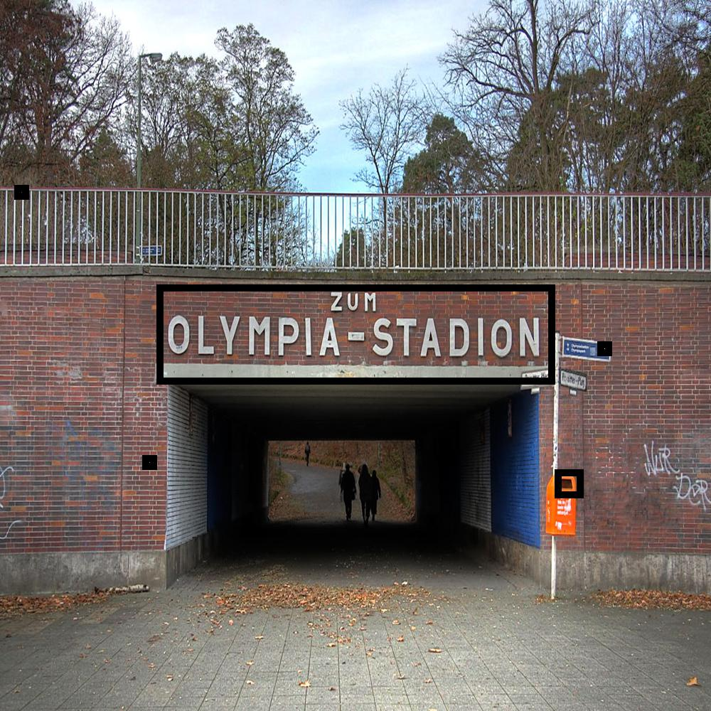
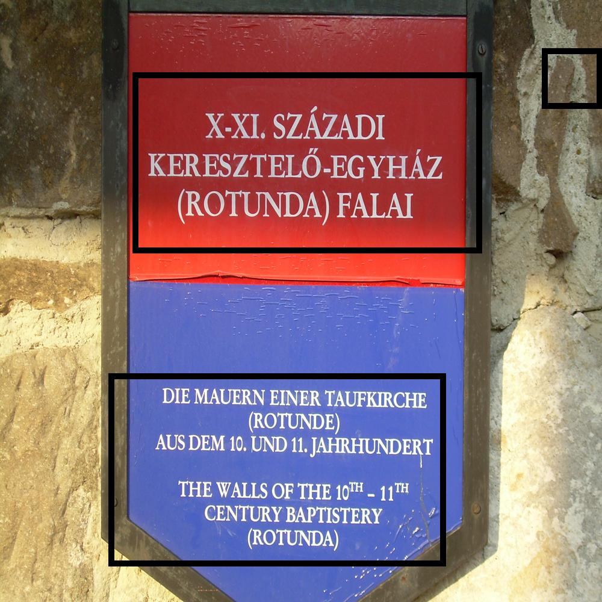
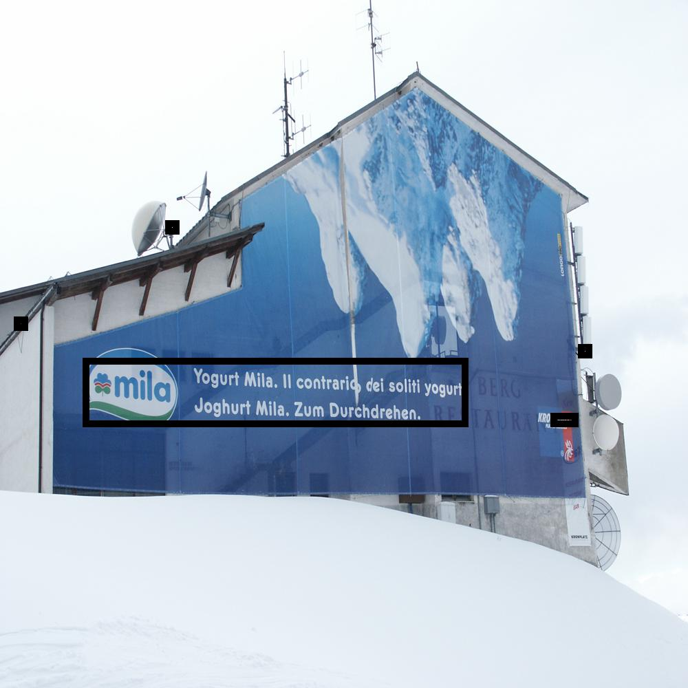
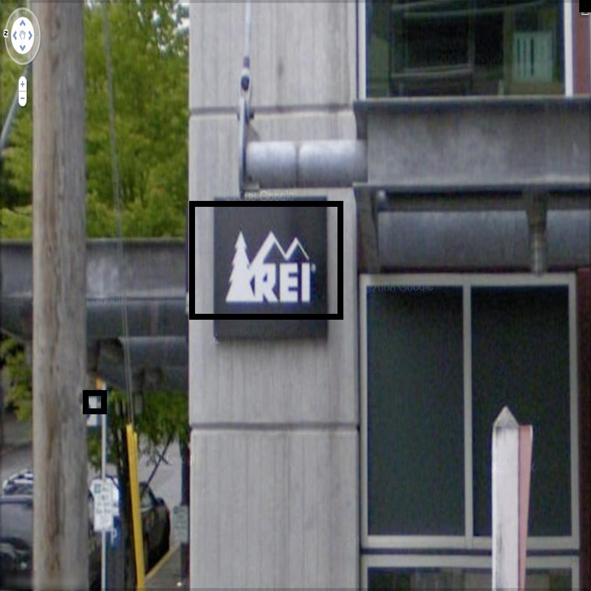

# Weakly-Supervised-Street-Text-Detection
Weakly supervised street text detection, localisation and segmentation in Pytorch. This is not the most optimal way of doing the same. I am working on optimizing accuracy and speed.
[i am yet to release latest code with improved performance with resnet18 and inference optimization]

Some cherry picked examples of localized text

<div style="text-align:center">
</img>
</img>
</img>
</img>
</div>

## Working
<p text-align="justify">The Weakly supervised algorithm is trained by first training a character agnostic text detection network by training it with images of various charecters and non-textual. Further, this network is used to label unlabelled images producing images with corresponding segmented masks. These unlabelled images are used to train a network to train a text segmentation network. From the segmented masks, the bounding boxes are derived.</p>

## Instructions

1. Install the required python packages by running

   ```pip install -r requirements.txt```

2. Download Chars74k dataset <a target="_blank" href="http://www.ee.surrey.ac.uk/CVSSP/demos/chars74k/">Chars74k dataset</a> and place it in the root directory
3. Place images of unlabelled street view text in the folder called Images. I used the <a target="_blank" href="http://vision.ucsd.edu/~kai/svt/">UCSD SVT</a> dataset and a select of images from <a target="_blank" href="http://www.iapr-tc11.org/mediawiki/index.php/NEOCR:_Natural_Environment_OCR_Dataset">NEOCR</a> dataset. [I will upload my split and share it soon]
4. Place various without any text in the folder called Background. Recommeded a combination of indoor/outdoor scenes without text [I will upload my split and share it soon]
5. Train a charecter recognition network by running

   ```python3 train_charmodel.py```

6. Label the images using the following command

   ```python3 label_images.py```

7. Train a localisation , detection and segmentation network by running the command

   ```python3 train_localizationmodel.py```
